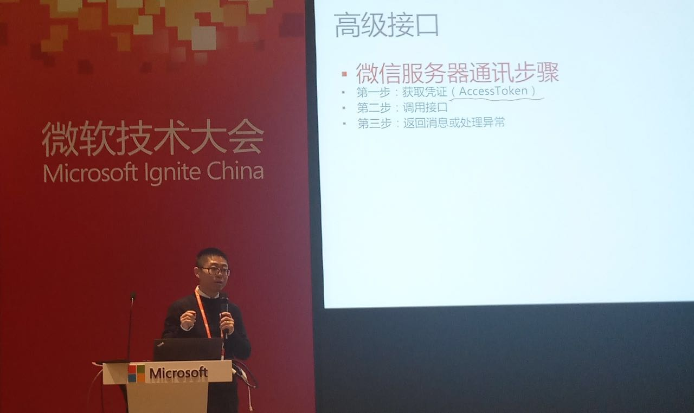
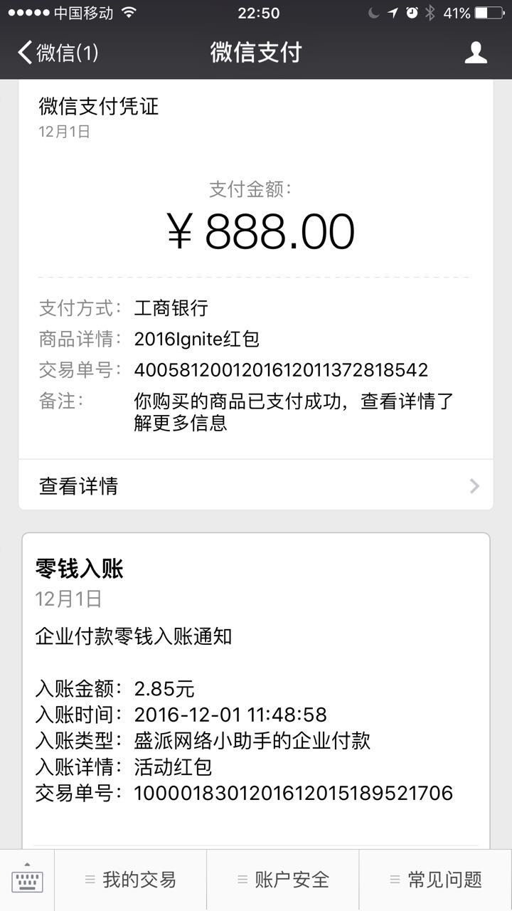
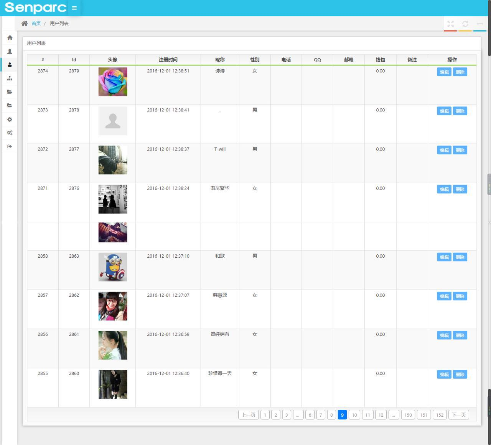
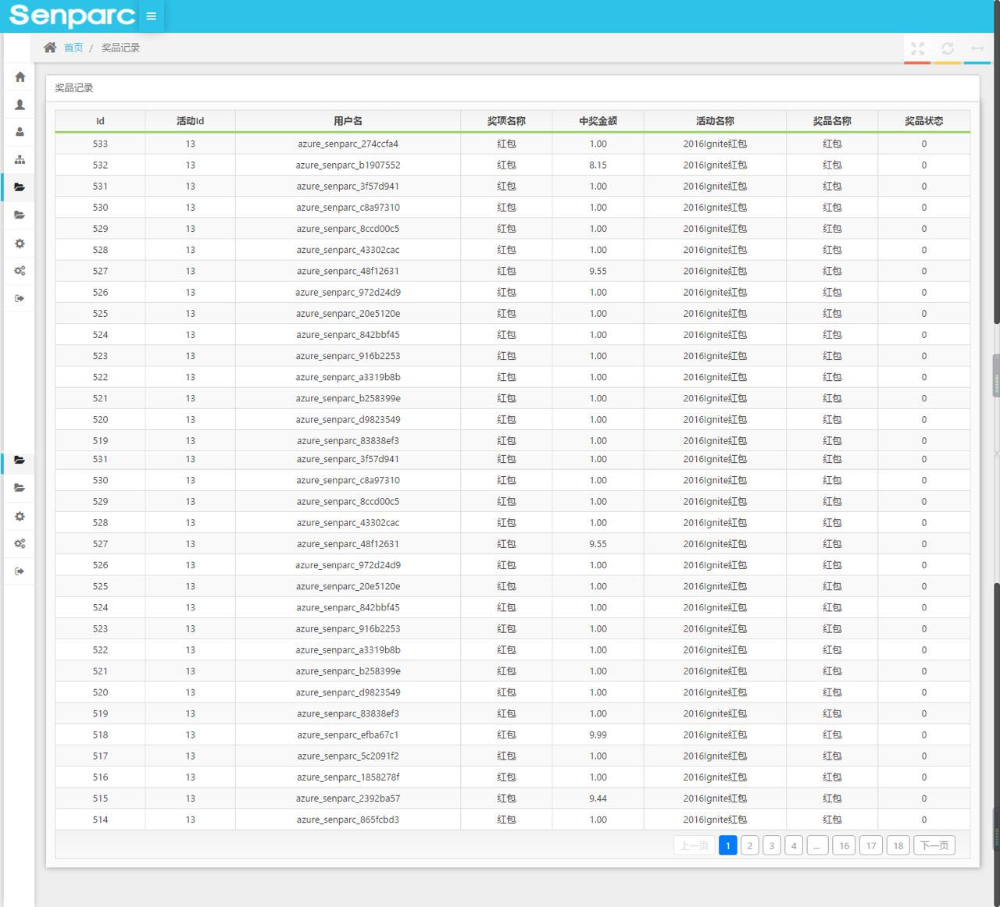

# 在Azure上使用WebApps部署微信

> [时间：2016.12.03] [作者：JeffreySu] [关键字：Microsofot,Azure,微信,部署]

[PPT下载](files/2016_Ignite_Wechat/2016_Ignite_Wechat.pdf)

## 说明
此PPT为2016年12月1日，2016微软开发者大会（Microsoft Ignite）上“Azure-微信”主题课程的PPT整理。

讲师为刘士君和苏震巍。

## 现场微信营销系统原型Demo
正在做进一步优化，正式整合到Azure“一键安装”后将更新本条信息，请关注。届时将可以免费使用。

场内和场外共计超过3000余人参与了Demo互动。

### 现场及互动

介绍微信开发

红包

现金入账

超过3000人参与

企业支付，现金入账

## 视频
正在等待官方整理。