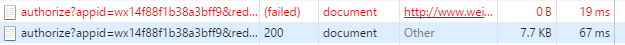

# 解决OAuth出现40029(invalid code)错误

> [时间：2016.09.13] [作者：JeffreySu] [关键字：OAuth,40029,invalid code]

## 关于OAuth

官方教程：https://mp.weixin.qq.com/wiki?t=resource/res_main&id=mp1421140842&token=&lang=zh_CN

原理及基本开发思路：http://www.cnblogs.com/szw/p/3764275.html

## 现象

在使用公众号的OAuth过程中，我们有时会碰到40029（invalid code，不合法的oauth_code的错误）的错误。


## 原因

其实通过官方提供的API获取的CODE通常是不会有问题的，不可用是因为这个CODE被悄悄地用掉了。

通过微信Web开发工具跟踪可以看到，微信发起了2次“相同”的请求，第一次请求被其终止掉了（也就是我们主动发起的这一次）：



这两次请求的Url还是有差别的，第一次我们通过“GetAuthorizeUrl”接口获取到的url如下：

> https://open.weixin.qq.com/connect/oauth2/authorize?appid=wxxx&redirect_uri=xxx&response_type=code&scope=snsapi_userinfo&state=MyState

这次请求会被微信服务器中断，然后由微信再自动发起一次：

> https://open.weixin.qq.com/connect/oauth2/authorize?appid=wxxx&redirect_uri=xxx&response_type=code&scope=snsapi_userinfo&state=MyState&uin=MTMyMjE0NDU%3D&key=63e987ba88ddfb44972f00256f262220434daa5ef8d27994eeb1cf525b6ddf2c5fc2aeb69d08087f5c139292417a774e&pass_ticket=SISrTjV8ln27168AZM/sFXkc2yp5i2lm+rwItExPL+PxZBu2/GXq1MbUp6BvmnWAB0KtpV9nypybsh41CV2SQA=

对比可以发现第二次请求多了两个参数：

> &uin=MTMyMjE0NDU%3D&key=63e987ba88ddfb44972f00256f262220434daa5ef8d27994eeb1cf525b6ddf2c5fc2aeb69d08087f5c139292417a774e
> &pass_ticket=SISrTjV8ln27168AZM/sFXkc2yp5i2lm+rwItExPL+PxZBu2/GXq1MbUp6BvmnWAB0KtpV9nypybsh41CV2SQA=

这两个参数应该也是出于的安全的需要，但是这么一来，给开发者的服务器就会带来困扰：
第一次请求虽然微信服务器终止了，但是开发者服务器还在运行，多数情况下已经使用了redirect_uri，并把传递过来的code使用掉了（code是一次性的），
当第二次请求进来的时候，我们用相同的code自然就失效了。

## 解决方案一（推荐★☆☆☆☆）

从图中可以看到，其实两次请求的发起者是不一样的，可以从这个角度入手，鉴别正确的请求。

当然这个方法有一定的风险：两次请求发生的时间间隔非常小（上图为19毫秒），仍然需要处理异步的问题。

## 解决方案二（推荐★★☆☆☆）

这也是网传的一个方案：在正常获取了微信官方的url后面，加上&connect_redirect=1这个参数，微信就不会发起第二次，
但是本人测试没有成功，然收到了两次。

## 解决方案三（推荐★★★★☆）

既然第二次请求的参数和第一次不一样，就可以从uin和pass_ticket两个参数进行判断，只接受有这两个参数的请求。

这种做法的缺点是这个请求参数并没有体现在官方文档中，或许会悄悄地进行变化，所以需要时刻关注其有效性。

此方案作为一个条件加入到其他方案中还是不错的。

## 解决方案四（推荐★★★★★）

利用同步锁，判断code的使用情况，这是最粗犷也是最彻底的方法，以 C# 使用 Senparc.Weixin SDK 为例，直接上代码：

定义静态变量：

```
    static Dictionary<string, OAuthAccessTokenResult> OAuthCodeCollection = new Dictionary<string, OAuthAccessTokenResult>();
    static object OAuthCodeCollectionLock = new object();
        
```

回调方法内：

```
    string openId;
    OAuthAccessTokenResult result = null;

    try
    {
        //通过，用code换取access_token

        var isSecondRequest = false;
        lock (OAuthCodeCollectionLock)
        {
            isSecondRequest = OAuthCodeCollection.ContainsKey(code);
        }

        if (!isSecondRequest)
        {
            //第一次请求
            LogUtility.Weixin.DebugFormat("第一次微信OAuth到达，code：{0}", code);
            lock (OAuthCodeCollectionLock)
            {
                OAuthCodeCollection[code] = null;
            }
        }
        else
        {
            //第二次请求
            LogUtility.Weixin.DebugFormat("第二次微信OAuth到达，code：{0}", code);

            lock (OAuthCodeCollectionLock)
            {
                result = OAuthCodeCollection[code];
            }
        }

        try
        {
            try
            {
                result = result ?? OAuthApi.GetAccessToken(SiteConfig.YourAppId, SiteConfig.YourAppSecret, code);
            }
            catch (Exception ex)
            {
                return Content("OAuth AccessToken错误：" + ex.Message);
            }

            if (result != null)
            {
                lock (OAuthCodeCollectionLock)
                {
                    OAuthCodeCollection[code] = result;
                }
            }
        }
        catch (ErrorJsonResultException ex)
        {
            if (ex.JsonResult.errcode == ReturnCode.不合法的oauth_code)
            {
                //code已经被使用过
                lock (OAuthCodeCollectionLock)
                {
                    result = OAuthCodeCollection[code];
                }
            }
        }

        openId = result != null ? result.openid : null;
    }
    catch (Exception ex)
    {
        return Content("授权过程发生错误：" + ex.Message);
    }

    //使用result继续操作
```

> 说明：
> 1、上述静态Dicitonary的储存方式适用于单台服务器，如果是分布式的系统，这里的Dictionary请使用公共缓存（如Redis），并使用分布锁，否则如果两次请求命中了两台不同的服务器仍然会失效。
> 2、请注意做好缓存清理工作

# 解决方案总结

以上解决方案没有绝对的好坏之分，要看具体的环境，因为都不会涉及到影响效率和安全性的问题，可以视情况组合使用。推荐指数更多倾向于通用性。

## 参考资料

微信网页授权：https://mp.weixin.qq.com/wiki?t=resource/res_main&id=mp1421140842&token=&lang=zh_CN

Senparc.Weixin.MP SDK 微信公众平台开发教程（十二）：OAuth2.0说明：http://www.cnblogs.com/szw/p/3764275.html